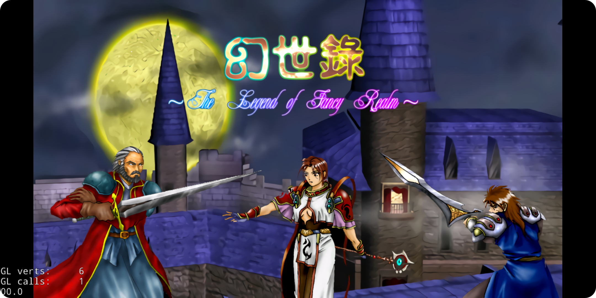
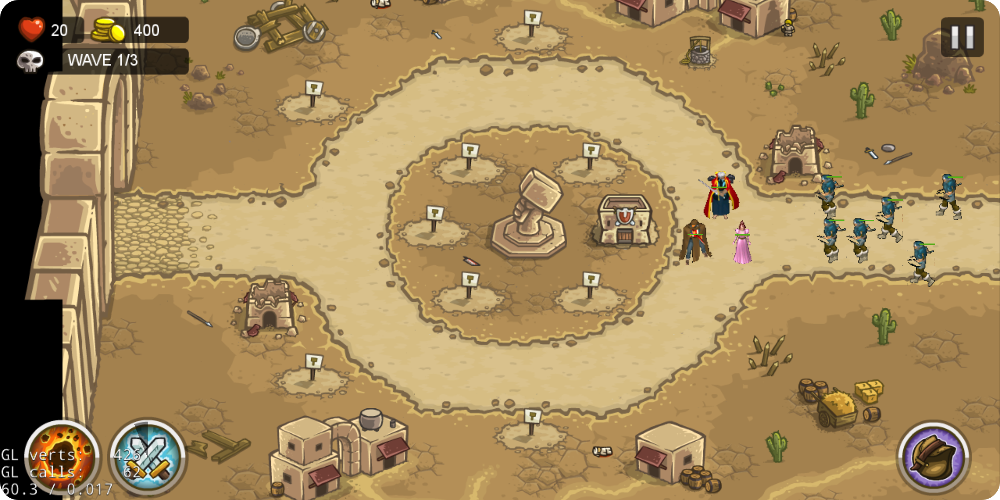

# KingdomRushFrontiersMod 
This is a game mod from [the amazing open-sourced project](https://github.com/exmex/KingdomRushFrontiers) about KingdomRush. 
The code has been modified using resources from an old game [幻世录](https://zh.wikipedia.org/zh-hans/%E5%B9%BB%E4%B8%96%E9%8C%84%E7%B3%BB%E5%88%97). 
It may sound surprising that people still play and care about a game developed back in 1995. 
In fact, 幻世录 is highly recommended to play/revisit, and it comes with an excellent game story writing. 

## Demo

## Build
The code has been tested on `Android Studio Dolphin Build #AI-213.7172.25.2113.9123335` with `cocos2d-x-4.0` and `Cocos Console 2.3`.
The simulator device is `Pixel 3a XL API 30` with `NDK 21.4.7075529`. 
After configuring the environment, following steps are required to play the game:

- Download and unzip the [幻世录 resource](https://drive.google.com/file/d/1omKuoZ6VqBOwcG8fglS7V8Hq8ZstVpft/view?usp=sharing) in the repo folder
- Execute `setup.sh` in bash
- Open Android Studio to build for ~10 minutes 

## FAQ
Q: What if Android Studio asks for upgrading the gradle version?

A: It is very likely to happen. Follow the instruction to upgrade, so far so good.

Q: How to modify levels?

A: Look into `plist` files in resources. Those files describe the map, enemies and their walking route. [TexturePacker](https://www.codeandweb.com/texturepacker) can be a great tool.

Q: How to add new character?

A: Follow the example in `Classes/Monster`. 
There are normal enemy and boss enemy. 
The animations are defined in `Classes/Data`. 
It is highly recommended to read and understand the source code. 

## TO DO
First of all, this project is not complete, especially in terms of level design.
There are still many things to play with:
- [ ] change game music and map
- [ ] provide high resolution pictures since those from 幻世录 are in low resolution
- [ ] develop procedurally generated levels
- [ ] develop gaming AI 

## Copyright
This is just personal game programming practice. 
The code is subject to the copyright of original code base. 
The repo can be removed anytime upon the request of any violation warning. 
